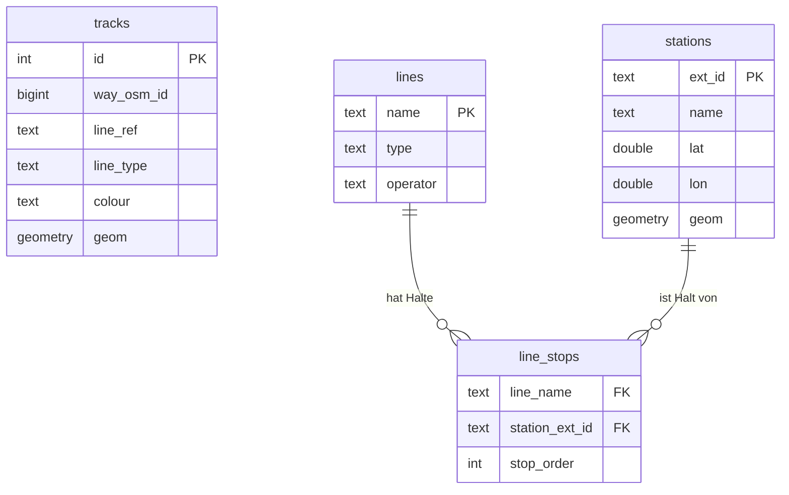

# BahnSim Backend – Architektur & Datendoku

---

## Inhaltsverzeichnis

1. [Warum zwei Datenquellen?](#1-warum-zwei-datenquellen)
2. [Gesamtarchitektur – Überblick](#2-gesamtarchitektur--überblick)
3. [Datenbankschema (ER-Diagramm)](#3-datenbankschema-er-diagramm)
4. [Datenquelle 1: OSM-Import](#4-datenquelle-1-osm-import)
5. [Datenquelle 2: HAFAS-Import](#5-datenquelle-2-hafas-import)
6. [Datenbank-Writer](#6-datenbank-writer)
7. [REST-API Endpunkte](#7-rest-api-endpunkte)
8. [Startsequenz der App](#8-startsequenz-der-app)
9. [Frontend-Guide: Linien und Stationen rendern](#9-frontend-guide-linien-und-stationen-rendern)

---

## 1. Warum zwei Datenquellen?

Das Backend zieht Daten aus zwei völlig verschiedenen Quellen – das ist bewusste Entscheidung, weil **keine Quelle alleine alles hat**:

| Was ich brauche | OSM | HAFAS |
|---|---|---|
| Exakte GPS-Koordinaten der Gleise | ✅ Ja | ❌ Nein |
| Farben der Linien (z.B. U1 = dunkelrot) | ✅ Oft vorhanden | ❌ Nein |
| Offizielle Stationsnamen | ⚠️ Inkonsistent | ✅ Ja (amtlich) |
| Eindeutige Stations-IDs | ❌ Nein | ✅ Ja (extId) |
| Reihenfolge der Halte pro Linie | ❌ Nein | ✅ Ja (journeyDetail) |
| Echtzeit-Abfahrten (Zukunft) | ❌ Nein | ✅ Ja |

**OSM** = die Landkarte mit exakter Gleisgeometrie, aber ohne Fahrplan-Wissen.  
**HAFAS** = der Fahrplan (VBB-API) mit allen Stations- und Linieninfos, aber ohne Geometrie.

Zusammen ergibt sich ein vollständiges Bild: Wir können Gleise auf der Karte zeigen **und** wissen, welche Linie wo hält.

---

## 2. Gesamtarchitektur – Überblick

```
┌─────────────────────────────────────────────────────────────────┐
│                        Spring Boot App                          │
│                                                                 │
│  ┌──────────────┐   beim Start   ┌─────────────────────────┐   │
│  │ ImportRunner │────────────────▶│ OsmParser               │   │
│  │ (ApplicationRunner)           │ liest berlin.osm.pbf    │   │
│  │              │                └────────────┬────────────┘   │
│  │              │                             │ List<OsmTrack> │
│  │              │                ┌────────────▼────────────┐   │
│  │              │                │ DatabaseWriter          │   │
│  │              │                │ schreibt → tracks       │   │
│  │              │                └─────────────────────────┘   │
│  │              │                                               │
│  │              │   beim Start   ┌─────────────────────────┐   │
│  │              │────────────────▶│ HafasImporter           │   │
│  │              │                │ ruft VBB-API auf        │   │
│  └──────────────┘                └────────────┬────────────┘   │
│                                               │                 │
│                                  ┌────────────▼────────────┐   │
│                                  │ DatabaseWriter          │   │
│                                  │ schreibt → stations     │   │
│                                  │            lines        │   │
│                                  │            line_stops   │   │
│                                  └─────────────────────────┘   │
│                                                                 │
│  ┌─────────────────────────────────────────────────────────┐   │
│  │ NetworkController  (REST-API auf Port 8080)              │   │
│  │  GET /api/tracks          ← aus Tabelle tracks          │   │
│  │  GET /api/stations        ← aus Tabelle stations        │   │
│  │  GET /api/lines           ← aus Tabelle lines           │   │
│  │  GET /api/lines/{n}/stops ← JOIN line_stops + stations  │   │
│  │  GET /api/network         ← stations + lines zusammen   │   │
│  └─────────────────────────────────────────────────────────┘   │
│                                                                 │
└─────────────────────────────────────────────────────────────────┘
         │                                  ▲
         ▼                                  │
  ┌─────────────┐                    ┌──────┴──────┐
  │ PostgreSQL  │                    │  Frontend   │
  │ + PostGIS   │                    │  (React o.ä)│
  └─────────────┘                    └─────────────┘
```

---

## 3. Datenbankschema (ER-Diagramm)

```
┌──────────────────────────────────────┐
│              tracks                  │   ◄── kommt aus OSM
├──────────────────────────────────────┤
│ id           SERIAL  PK              │
│ way_osm_id   BIGINT                  │   ← OSM-ID des Ways (Schienenstücks)
│ line_ref     TEXT    (z.B. "U1")     │   ← welche Linie (aus OSM-Relation)
│ line_type    TEXT    (z.B. "subway") │   ← Typ der Linie
│ colour       TEXT    (z.B. "#7DAD4C")│   ← Farbe aus OSM-Tags
│ geom         GEOMETRY(LINESTRING)    │   ← GPS-Koordinaten des Gleisabschnitts
└──────────────────────────────────────┘
          (keine FK zu lines! OSM-Namen ≠ HAFAS-Namen)


┌──────────────────────────────────────┐
│             stations                 │   ◄── kommt aus HAFAS
├──────────────────────────────────────┤
│ ext_id  TEXT  PK  (z.B."900100003") │   ← HAFAS-interne eindeutige ID
│ name    TEXT       (z.B. "S+U Alex")│
│ lat     DOUBLE                       │
│ lon     DOUBLE                       │
│ geom    GEOMETRY(POINT)              │   ← Punkt-Geometrie für PostGIS
└──────────────────────────────────────┘
         ▲
         │  (FK: station_ext_id → stations.ext_id)
         │
┌──────────────────────────────────────┐
│            line_stops                │   ◄── kommt aus HAFAS journeyDetail
├──────────────────────────────────────┤
│ line_name      TEXT  FK→lines.name   │
│ station_ext_id TEXT  FK→stations.ext_id│
│ stop_order     INT                   │   ← Reihenfolge der Halte (0, 1, 2...)
│ PRIMARY KEY (line_name, station_ext_id)│
└──────────────────────────────────────┘
         │
         │  (FK: line_name → lines.name)
         ▼
┌──────────────────────────────────────┐
│               lines                  │   ◄── kommt aus HAFAS
├──────────────────────────────────────┤
│ name     TEXT  PK  (z.B. "U 2")     │   ← HAFAS-Name (Schlüssel)
│ type     TEXT      (z.B. "subway")  │
│ operator TEXT      (z.B. "BVG")     │
└──────────────────────────────────────┘
```

### Mermaid-ER-Diagramm (für Markdown-Renderer mit Mermaid-Support)



---

## 4. Datenquelle 1: OSM-Import

### Was ist OSM?

OpenStreetMap ist eine freie Weltkarte, in der Freiwillige alle Straßen, Wege, Gebäude und **Schienen** eingetragen haben. Für Berlin gibt es eine `.osm.pbf`-Datei (~98 MB) mit allem.

### Was extrahieren wir daraus?

Nur die **physische Gleisgeometrie** – also die exakten GPS-Koordinaten der Schienen auf dem Boden. Das sind die Linien, die wir auf der Karte zeichnen.

### Dateistruktur: `OsmParser` + `OsmTrack`

```
OsmParser.kt         ← liest die PBF-Datei, gibt List<OsmTrack> zurück
OsmModel.kt          ← Datenklasse OsmTrack
```

### Wie funktioniert der OSM-Parser?

OSM-PBF hat eine feste Struktur: **Nodes → Ways → Relations** (in dieser Reihenfolge in der Datei).

- **Node** = ein einzelner GPS-Punkt (lat/lon)
- **Way** = eine geordnete Liste von Node-IDs → ein Streckenstück
- **Relation** = Gruppe von Ways → eine komplette Linie (z.B. alle Abschnitte der U1)

Weil die Datei zu groß ist, um alles im RAM zu halten, lesen wir **3 Pässe**:

```
Pass 1 – Relations lesen:
  → Finde alle Relations mit route=subway/light_rail/tram
  → Filtere nach Berliner Netzen (VBB, BVG, S-Bahn Berlin)
  → Merke: welche Way-IDs gehören zu welcher Linie?
  → Ergebnis: Map<WayId → WayMeta(lineRef, lineType, colour)>
  → Beispiel: WayId 12345 → WayMeta("U1", "subway", "#7DAD4C")

Pass 2 – Ways lesen:
  → Lese nur die Ways, die wir in Pass 1 gefunden haben
  → Ergebnis: Map<WayId → List<NodeId>>
  → Beispiel: WayId 12345 → [NodeId 111, NodeId 222, NodeId 333]

Pass 3 – Nodes lesen:
  → Lese nur die Nodes, die in unseren Ways vorkommen
  → Ergebnis: Map<NodeId → (lat, lon)>
  → Beispiel: NodeId 111 → (52.5200, 13.4050)

Zusammenbauen:
  → WayId + Meta + Koordinaten = OsmTrack
  → OsmTrack(wayId=12345, lineRef="U1", lineType="subway",
             colour="#7DAD4C", coords=[(52.52, 13.40), (52.53, 13.41), ...])
```

### Warum 3 Pässe?

PBF-Dateien sind riesig (98 MB unkomprimiert, mehrere GB). Alles in den RAM zu lesen würde für große Städte nicht funktionieren. Mit 3 Pässen lesen wir die Datei 3× sequenziell, merken uns aber immer nur das Nötigste.

### Was landet in der Datenbank?

**Tabelle `tracks`**: Pro OSM-Way ein Eintrag mit:
- `way_osm_id` – OSM-interne ID
- `line_ref` – "U1", "S41", etc. (kommt aus dem OSM-Tag `ref` der Relation)
- `line_type` – "subway", "light_rail", "tram"
- `colour` – Hex-Farbe wie "#7DAD4C" (kommt aus OSM-Tag `colour`)
- `geom` – PostGIS-LINESTRING mit allen GPS-Punkten des Gleisabschnitts

**Wichtig**: Eine Linie (z.B. U1) besteht aus **vielen einzelnen Ways**. Im Datensatz Berlin sind es **4359 Gleisabschnitte** für alle Linien zusammen.

---

## 5. Datenquelle 2: HAFAS-Import

### Was ist HAFAS?

HAFAS ist das Fahrplanauskunftssystem des VBB (Verkehrsverbund Berlin-Brandenburg). Über eine REST-API können wir Stationen suchen, Abfahrten abfragen und Fahrtdetails laden.

**API-Base-URL**: `https://vbb-demo.demo2.hafas.cloud/api/fahrinfo/latest`  
**Access-ID**: `Galiao-4802-a722-82559b5db352`

### Dateistruktur

```
HafasClient.kt    ← HTTP-Aufrufe an die VBB-API
HafasModel.kt     ← Datenklassen für die API-Antworten
HafasImporter.kt  ← Orchestriert den 4-Schritt-Import
```

### Wie funktioniert der HAFAS-Import?

#### Schritt 1: Seed-Stationen finden (`location.name`)

Wir starten mit bekannten Berliner Großbahnhöfen als "Anker":

```
Berlin Hauptbahnhof, S+U Alexanderplatz, S+U Zoologischer Garten,
S+U Spandau, S+U Pankow, S+U Lichtenberg, S+U Gesundbrunnen,
S+U Südkreuz, Wannsee, Ahrensfelde, Bernau, Oranienburg, S+U Ostbahnhof
```

Die HAFAS-API gibt pro Name ein `StopLocation`-Objekt zurück mit:
- `extId` – eindeutige HAFAS-Stations-ID (z.B. "900000100003")
- `name` – offizieller Stationsname
- `lat`, `lon` – Koordinaten

Warum Seed-Stationen? Weil HAFAS keine "gib mir alle Stationen"-API hat. Wir brauchen einen Startpunkt, von dem aus wir Linien entdecken.

#### Schritt 2: Abfahrten abfragen → Linien entdecken (`departureBoard`)

Pro Seed-Station fragen wir die nächsten 100 Abfahrten ab. Jede Abfahrt hat einen Liniennamen (z.B. "U 2", "S 1", "M10") und eine `JourneyDetailRef`.

So entdecken wir automatisch alle aktiven Linien, die durch Berlins Hauptbahnhöfe fahren:

```
Station "S+U Alexanderplatz" → Abfahrten:
  - "S 5" um 14:02 → JourneyDetailRef = "https://..."
  - "U 2" um 14:03 → JourneyDetailRef = "https://..."
  - "M4"  um 14:03 → JourneyDetailRef = "https://..."
  - ...
```

Wir speichern pro **Linienname** nur **eine** JourneyDetailRef (die erste gefundene).

#### Schritt 3: Fahrtdetails → alle Halte einer Linie (`journeyDetail`)

Pro entdeckter Linie rufen wir die `journeyDetail`-API auf. Die gibt uns alle Haltestellen dieser Fahrt in Reihenfolge:

```
Linie "U 2":
  Stop 0: extId=900000100001, name="Ruhleben", lat=52.525, lon=13.229
  Stop 1: extId=900000100002, name="Theodor-Heuss-Platz", lat=52.508, lon=13.283
  Stop 2: extId=900000100003, name="Bismarckstraße", lat=52.516, lon=13.302
  ...
  Stop 28: extId=900000100029, name="Pankow", lat=52.568, lon=13.401
```

Damit haben wir:
- Alle Stationen mit Koordinaten
- Die exakte Reihenfolge der Halte pro Linie

#### Schritt 4: In DB schreiben

```
→ stations    : alle einzigartigen Haltestellen
→ lines       : alle Linien mit Typ und Betreiber
→ line_stops  : welche Station hält wo in welcher Reihenfolge
```

### Warum `Thread.sleep(300)` im Import?

Die VBB-API ist ein **Testsystem**, kein Produktivsystem. Zu viele Anfragen in kurzer Zeit würden uns temporär sperren. 300ms Pause zwischen jedem `journeyDetail`-Aufruf hält uns unter dem Rate-Limit.

---

## 6. Datenbank-Writer

```
DatabaseWriter.kt   ← alle DB-Schreiboperationen
```

Warum ein eigener Writer? Trennung von Verantwortlichkeiten:
- Parser/Importer kennen die API/Dateien → sie produzieren Kotlin-Objekte
- DatabaseWriter kennt die DB-Struktur → er schreibt die Objekte rein
- Das macht beide Seiten testbar und austauschbar

### Besonderheiten

**Batching**: Statt 4000× einzelne INSERTs nutzen wir `jdbc.batchUpdate()` mit 500er-Paketen. Das ist ~50× schneller.

**ON CONFLICT DO UPDATE**: Beim HAFAS-Import wird bei doppelten extIds die Station einfach aktualisiert statt einen Fehler zu werfen.

**Reihenfolge beim Löschen**: `line_stops` hat Foreign Keys auf `lines` und `stations`. Also:
```
DELETE line_stops → erst, weil FK
DELETE stations   → dann
DELETE lines      → dann
```
In umgekehrter Reihenfolge würde PostgreSQL mit einem FK-Fehler abbrechen.

**PostGIS-Funktionen**:
- `ST_GeomFromText('LINESTRING(lon lat, ...)', 4326)` – Gleislinie aus WKT-String
- `ST_SetSRID(ST_MakePoint(lon, lat), 4326)` – Station als Punkt
- `ST_AsText(geom)` – Geometrie zurück in WKT für die API
- `4326` ist das Koordinatensystem WGS84 (das, was GPS nutzt)

---

## 7. REST-API Endpunkte

Alle Endpunkte unter `http://localhost:8080/api/`

### `GET /api/tracks`

Gibt alle Gleisabschnitte zurück. Optional filtern mit `?type=subway`.

```json
[
  {
    "wayOsmId": 12345678,
    "lineRef": "U1",
    "lineType": "subway",
    "colour": "#7DAD4C",
    "points": [
      { "lat": 52.5200, "lon": 13.4050 },
      { "lat": 52.5210, "lon": 13.4070 },
      ...
    ]
  },
  ...
]
```

**Für Frontend**: Diese Daten zum Zeichnen der Gleislinien verwenden. Jeder Eintrag ist ein Liniensegment. Eine vollständige Linie (z.B. U1) besteht aus ~30-80 solcher Segmente.

### `GET /api/stations`

Alle Haltestellen.

```json
[
  {
    "extId": "900000100003",
    "name": "S+U Alexanderplatz",
    "lat": 52.5219,
    "lon": 13.4132
  },
  ...
]
```

### `GET /api/lines`

Alle Linien.

```json
[
  { "name": "U 1", "type": "subway",  "operator": "BVG" },
  { "name": "S 1", "type": "sbahn",   "operator": "S-Bahn Berlin" },
  { "name": "M10", "type": "tram",    "operator": "BVG" },
  ...
]
```

### `GET /api/lines/{lineName}/stops`

Haltestellen einer Linie **in Reihenfolge** (für die Animationspfade).

```
GET /api/lines/U 2/stops
```

```json
[
  { "extId": "900000100001", "name": "Ruhleben",             "lat": 52.525, "lon": 13.229 },
  { "extId": "900000100002", "name": "Theodor-Heuss-Platz",  "lat": 52.508, "lon": 13.283 },
  ...
  { "extId": "900000100029", "name": "Pankow",               "lat": 52.568, "lon": 13.401 }
]
```

### `GET /api/network`

Stations + Lines in einem Call – für den initialen Seitenload.

```json
{
  "stations": [ ... ],
  "lines":    [ ... ]
}
```

---

## 8. Startsequenz der App

```
App startet
    │
    ▼
Flyway-Migrationen laufen (V1, V2)
    │   V1: CREATE EXTENSION postgis
    │   V2: CREATE TABLE tracks, stations, lines, line_stops
    ▼
ImportRunner.run() wird aufgerufen
    │
    ├── importOsmTracks()
    │       ├── SELECT COUNT(*) FROM tracks
    │       ├── wenn > 0: "bereits vorhanden, übersprungen"
    │       └── wenn = 0:
    │               → OsmParser.parse()     (~30-60 Sekunden)
    │               → DatabaseWriter.writeOsmTracks()
    │
    └── importHafasData()
            ├── SELECT COUNT(*) FROM stations
            ├── wenn > 0: "bereits vorhanden, übersprungen"
            └── wenn = 0:
                    → HafasImporter.importAll()  (~60-120 Sekunden)
                    → DatabaseWriter.writeHafasData()
    │
    ▼
Tomcat startet → API erreichbar auf :8080
```

**Idempotent**: Der Import läuft nur einmal. Wenn die DB bereits Daten hat (z.B. nach Neustart), wird übersprungen. So startet die App beim zweiten Mal in ~3 Sekunden statt 2 Minuten.

---

## 9. Frontend-Guide: Linien und Stationen rendern

### Phase 1: Gleislinien zeichnen (OSM-Daten)

Das ist der erste Schritt – keine Stationen, nur die Schienen.

#### Daten holen

```javascript
const tracks = await fetch('http://localhost:8080/api/tracks').then(r => r.json())
// Optional nur U-Bahn:
// const tracks = await fetch('http://localhost:8080/api/tracks?type=subway').then(r => r.json())
```

#### Datenstruktur verstehen

```javascript
// Ein Track-Objekt:
{
  wayOsmId: 12345678,
  lineRef: "U1",          // ← Linienname aus OSM (kein Leerzeichen!)
  lineType: "subway",     // subway | light_rail | tram
  colour: "#7DAD4C",      // Hex-Farbe (kann leer sein!)
  points: [               // ← Die GPS-Koordinaten des Gleisabschnitts
    { lat: 52.520, lon: 13.405 },
    { lat: 52.521, lon: 13.407 },
    // ...
  ]
}
```

#### Wichtig: Ein Track ≠ eine Linie!

Die U1 hat z.B. 60 einzelne Tracks. Du musst alle Tracks mit `lineRef === "U1"` zusammen zeichnen, um die vollständige Linie zu sehen.

#### Tracks nach Linie gruppieren (JavaScript)

```javascript
// Gruppiere alle Tracks nach lineRef
const byLine = {}
for (const track of tracks) {
  if (!byLine[track.lineRef]) byLine[track.lineRef] = []
  byLine[track.lineRef].push(track)
}

// Jetzt kannst du pro Linie alle Segmente zeichnen:
for (const [lineRef, segments] of Object.entries(byLine)) {
  for (const segment of segments) {
    drawPolyline(segment.points, getColor(segment))
  }
}
```

#### Farbe bestimmen

```javascript
function getColor(track) {
  // 1. Nimm die OSM-Farbe wenn vorhanden
  if (track.colour && track.colour.length > 0) return track.colour

  // 2. Fallback nach Typ
  const fallbacks = {
    subway:     '#0057a8',  // Blau (generisch)
    light_rail: '#006f35',  // Grün
    tram:       '#be1414',  // Rot
  }
  return fallbacks[track.lineType] ?? '#888888'
}
```

#### Mit Leaflet (Beispiel)

```javascript
import L from 'leaflet'

const map = L.map('map').setView([52.52, 13.405], 12)
L.tileLayer('https://{s}.tile.openstreetmap.org/{z}/{x}/{y}.png').addTo(map)

for (const track of tracks) {
  // Leaflet erwartet [lat, lon] – genau wie unsere API liefert
  const latlngs = track.points.map(p => [p.lat, p.lon])
  L.polyline(latlngs, {
    color: getColor(track),
    weight: 3,
    opacity: 0.8
  }).addTo(map)
}
```

#### Mit Mapbox GL / Maplibre (Beispiel)

```javascript
// Tracks als GeoJSON aufbereiten
const geojson = {
  type: 'FeatureCollection',
  features: tracks.map(track => ({
    type: 'Feature',
    properties: {
      lineRef:  track.lineRef,
      lineType: track.lineType,
      colour:   track.colour || getColor(track)
    },
    geometry: {
      type: 'LineString',
      // Mapbox erwartet [lon, lat] – umgekehrt!
      coordinates: track.points.map(p => [p.lon, p.lat])
    }
  }))
}

map.addSource('tracks', { type: 'geojson', data: geojson })
map.addLayer({
  id: 'tracks-layer',
  type: 'line',
  source: 'tracks',
  paint: {
    'line-color': ['get', 'colour'],
    'line-width': 3
  }
})
```

---

### Phase 2: Stationen einblenden (HAFAS-Daten)

#### Option A: Alle Stationen auf einmal

```javascript
const stations = await fetch('http://localhost:8080/api/stations').then(r => r.json())

for (const station of stations) {
  L.circleMarker([station.lat, station.lon], {
    radius: 4,
    color: '#333',
    fillColor: '#fff',
    fillOpacity: 1,
    weight: 2
  })
  .bindTooltip(station.name)
  .addTo(map)
}
```

#### Option B: Nur Stationen einer bestimmten Linie

```javascript
// Stationen der U2 in Reihenfolge holen
const stops = await fetch('http://localhost:8080/api/lines/U 2/stops').then(r => r.json())
// ↑ Leerzeichen im URL encodieren:
// fetch('http://localhost:8080/api/lines/' + encodeURIComponent('U 2') + '/stops')

// Stationen zeichnen
for (const stop of stops) {
  L.marker([stop.lat, stop.lon])
    .bindPopup(stop.name)
    .addTo(map)
}

// Verbindungslinie zwischen den Stationen zeichnen (vereinfachte Linie)
const stationPath = stops.map(s => [s.lat, s.lon])
L.polyline(stationPath, { color: 'blue', dashArray: '5,10' }).addTo(map)
```

---

### Hinweis: OSM-Namen ≠ HAFAS-Namen

**Sehr wichtig**: Die Liniennamen in `tracks` (aus OSM) und in `lines` (aus HAFAS) **stimmen nicht 1:1 überein**!

| OSM `lineRef` | HAFAS `name` |
|---|---|
| `U1` | `U 1` (mit Leerzeichen) |
| `S41` | `S 41` oder `S41` |
| `M10` | `M10` (meistens gleich) |

Es gibt **keine direkte Verbindung** zwischen `tracks` und `lines` in der Datenbank. Das ist beabsichtigt: OSM-Tracks zeigen die physische Geometrie, HAFAS-Linien zeigen den Fahrplan. Für die Karte brauchst du beides unabhängig.

**Für eine spätere Verknüpfung** könnte man einen Normalisierungs-Join bauen (Leerzeichen entfernen, Großschreibung angleichen), aber das ist nicht zwingend nötig – man kann beide Datensätze parallel auf der Karte zeigen.

---

### Empfohlene Rendering-Reihenfolge

```
1. Kartengrundlage laden (OpenStreetMap-Tiles)
2. GET /api/tracks → Gleislinien zeichnen (farbige Polylines)
3. GET /api/stations → Haltepunkte zeichnen (kleine Kreise/Marker)
4. (Optional) GET /api/lines → Linien-Liste für Filter-UI
5. (Optional) Bei Klick auf Linie: GET /api/lines/{name}/stops → Halte hervorheben
```

---

*Letzte Aktualisierung: 2026-06-10*
